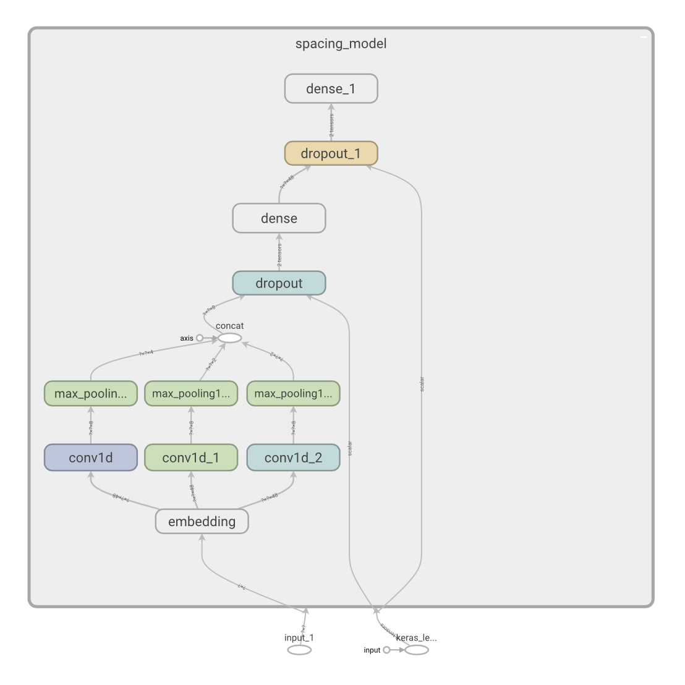

# Korean Spacing Model

한국어 문장 띄어쓰기(삭제/추가) 모델입니다. 데이터 준비 후 직접 학습이 가능하도록 작성하였습니다. 또한 전처리시에 띄어쓰기 정제를 할 것 같아 속도를 염두에 두고 작성하였습니다.

[데모 사이트](https://jeongukjae.github.io/korean-spacing-model)에서 나무위키 텍스트([lovit/namuwikitext](https://github.com/lovit/namuwikitext)) 50만 문장에 대해 학습한 모델의 결과를 확인할 수 있습니다. 자세한 설명은 [블로그 포스트](https://jeongukjae.github.io/posts/korean-spacing-model/)를 확인하시기 바랍니다.

## 모델 설명

`config.json`의 설정에 따라 다르지만 아래와 같은 구조를 가집니다.



Embedding을 거치고 난 뒤 여러개의 Conv1D - MaxPool1D 결과물을 Concat한 후 Dense Layer를 2개 거칩니다. input은 `(BatchSize, SequenceLength)`의 int32 형태의 tensor이며, output은 `(BatchSize, SequenceLength, 3)`의 tensor입니다. argmax 후 decode과정을 거치며, 0은 문자 유지, 1은 공백 문자 추가, 2는 현재 문자가 공백일 경우 공백 삭제의 의미를 지닙니다.

아래는 예시입니다.

```text
원본 string: 딥러닝 인 더 브라우저 책을 많이 참고하였습니다. 감 사 를표 합 니 다.
입력 (StaticHashTable 변환 전): ["<s>", "딥", "러", "닝", " ", "인", " ", "더", " ", "브", "라", "우", "저", " ", "책", "을", " ", "많", "이", " ", "참", "고", "하", "였", "습", "니", "다", ".", " ", "감", " ", "사", " ", "를", " ", "표", " ", "합", " ", "니", " ", "다", ".", "</s>"]
결과: [0,0,0,0,2,0,2,0,0,0,0,0,0,2,0,0,0,0,0,0,0,0,0,0,0,0,0,0,0,0,2,0,2,1,0,2,0,2,0,2,0,0,0]
결과 string: 딥러닝인더 브라우저책을 많이 참고하였습니다. 감사를 표합니다.
```

모델 사이즈가 워낙 작아 미리 학습한 모델을 SavedModel 형태로 현재 레포지토리의 `spacing-model/1/`에 넣어놓았습니다. 저장 스크립트는 `convert_ckpt_to_saved_model.py`를 참고하시기 바랍니다.

### 모델 속도

현재 `./resources/config.json`의 설정으로 아래와 같은 속도가 나옵니다.

```sh
$ python benchmark.py --training-config ./resources/config.json --batch-size 128 --sequence-length 128
2020-09-23 15:09:51.532982: I tensorflow/core/platform/cpu_feature_guard.cc:142] This TensorFlow binary is optimized with oneAPI Deep Neural Network Library (oneDNN)to use the following CPU instructions in performance-critical operations:  AVX2 FMA
To enable them in other operations, rebuild TensorFlow with the appropriate compiler flags.
2020-09-23 15:09:51.549687: I tensorflow/compiler/xla/service/service.cc:168] XLA service 0x7f849ecfb6c0 initialized for platform Host (this does not guarantee that XLA will be used). Devices:
2020-09-23 15:09:51.549708: I tensorflow/compiler/xla/service/service.cc:176]   StreamExecutor device (0): Host, Default Version
Warmup stage (10 iteration)
Benchmark model speed with random input (1000 iteration)
Elapsed: 11.318554162979126 s
Per batch: 0.011318554162979126 s
Per sentence: 8.842620439827443e-05 s
```

MacBook Pro (13-inch, 2020, Four Thunderbolt 3 ports) (2 GHz Quad-Core Intel Core i5)에서 batch size 128, sequence length 128로 CPU 추론을 돌릴 시 배치당 약 11ms, 한 문장당 약 0.088 ms 정도 소요됩니다.

동일한 설정으로 batch size만 1로 설정할 경우 아래정도의 추론 시간이 나옵니다.

```sh
Benchmark model speed with random input (1000 iteration)
Elapsed: 0.5187258720397949 s
Per batch: 0.0005187258720397949 s
Per sentence: 0.0005187258720397949 s
```

## 학습용 파일들

### 모델

사용한 모델은 [train.py#L14](https://github.com/jeongukjae/korean-spacing-model/blob/master/train.py#L14)를 참고하시기 바랍니다. 여러개의 Conv1D + MaxPool1D 결과물을 Concat 한 뒤 FFN을 거칩니다.

### `chars-4996`

Character -> Index 매핑을 지원하기 위해 사용하는 파일입니다. 단순히 연속하는 character를 저장하고 사용하는 방법은 아래와 같습니다.

```python
import tensorflow as tf

with open('./resources/chars-4996') as f:
    content = f.read()
    keys = ["<pad>", "<s>", "</s>", "<unk>"] + list(content)
    values = list(range(len(keys)))

    vocab_initializer = tf.lookup.KeyValueTensorInitializer(keys, values, key_dtype=tf.string, value_dtype=tf.int32)
    vocab_table = tf.lookup.StaticHashTable(vocab_initializer, default_value=3)
```

왜 4996개만 넣어놓았나요??

```python
>>> from collections import Counter
>>> c = Counter()
>>> f = open("namuwikitext_20200302.train.processed")
>>> for line in f:
>>>     c.update(line)
>>> sum([v for _, v in c.most_common(4996)]) / sum([v for _, v in c.most_common()])
0.9996295887538321
```

위를 보면 4996개의 vocab만 가져도 char coverage 0.9996가 넘습니다. (4개는 unk + bos + eos + pad)

### `config.json`

예시: [`./resources/config.json`](./resources/config.json)

```json
{
    "vocab_size": 5000,
    "hidden_size": 48,
    "conv_activation": "relu",
    "dense_activation": "relu",
    "conv_kernel_and_filter_sizes": [[2, 8], [3, 8], [4, 8], [5, 16], [6, 16], [7, 16], [8, 16], [9, 16], [10, 16]],

    "train_batch_size": 64,
    "val_batch_size": 1024,
    "epochs": 30,
    "learning_rate": 0.001,
    "dropout_rate": 0.1
}
```

너무 간단한 모델이라 학습 설정 & 모델 설정을 한 파일안에 넣어두었습니다.

## 학습 방법

### 데이터 준비

train, dev 파일은 text파일로 한 줄에 한 instance임을 가정합니다.

### 학습 시작

```shell
$ python train.py \
    --train-file train-text-file-path \
    --dev-file dev-text-file-path \
    --training-config ./resources/config.json \
    --char-file ./resources/char-4996
```

학습 설정이나 vocab을 바꾸고 싶다면 char-file이나 training-config를 바꾸면 됩니다.

학습 시에 `train.py`의 `string_to_example` 함수가 실제 텍스트에서 문장을 뽑아 space를 추가하고 삭제하는 등의 데이터를 만드는 역할을 합니다.

### 문장 돌려보기

```shell
$ python run_sentences.py \
    --char-file ./resources/char-4996 \
    --model-file ./checkpoint-path/checkpoin.ckpt \
    --training-config ./resources/config.json
...
Model Summary
...

Str: 딥러닝 인 더 브라우저 책을 많이 참고하였습니다. 감 사 를표 합 니 다.
<s>딥러닝인더 브라우저책을 많이 참고하였습니다. 감사를 표합니다.</s>
Str:
```

위와 같은 식으로 interactive하게 문장을 테스트해보는 스크립트입니다.

## ---

* 간단한 토이 프로젝트 용도인 모델입니다.
* 실제로 사용하고 싶고, 중간에 공백을 추가하고 싶지 않은 단어가 있다면 직접 decode 함수를 작성할 수 있습니다. 기본적인 decode 함수는 [`run_sentences.py#L54`](https://github.com/jeongukjae/korean-spacing-model/blob/master/run_sentences.py#L54)를 참고하세요.
* 나무위키 텍스트에서 학습을 시킨 결과 어느정도 정제된 말투에서는 띄어쓰기를 잘 해내는 경향을 보입니다. 실제로 테스트를 해보진 않았지만 구어체에서도 사용가능할 것으로 보입니다.
